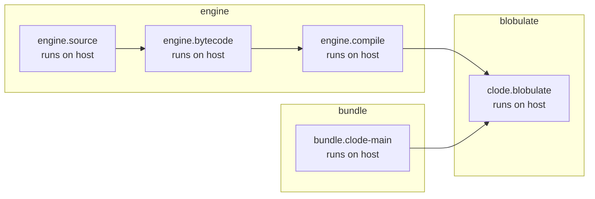
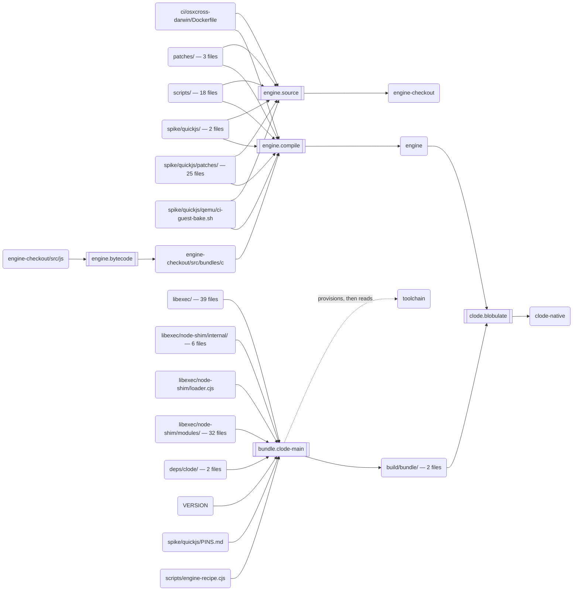
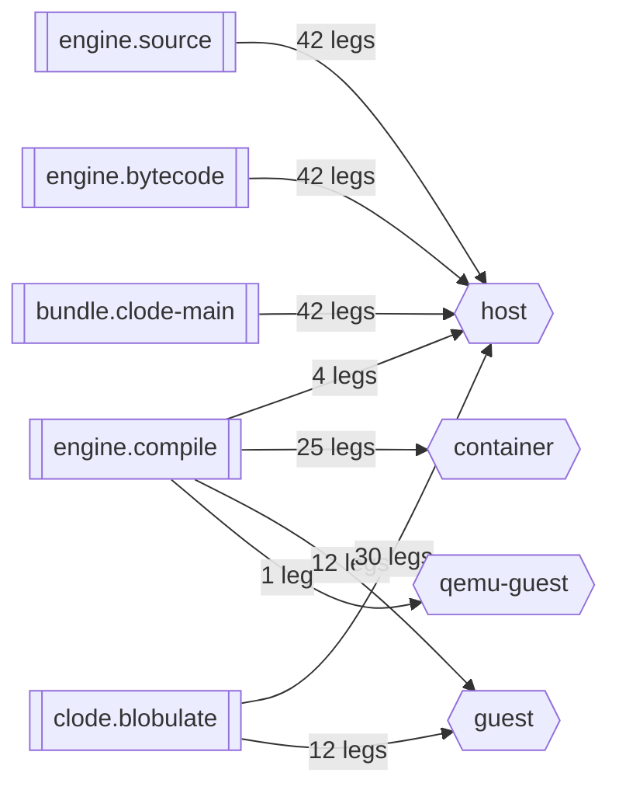

<!-- GENERATED FILE — do not edit. Written by `node scripts/render-build-graph.cjs --write` from the
     build graph declared in scripts/build-graph.cjs. test/build-graph-render.test.cjs fails when
     this file is not byte-for-byte what the renderer emits today. -->

# Building clode

`./build.sh` turns a clean clone into a working `clode-native` — the builder this repo ships.
It is the only command a developer needs, and everything below is drawn from the one
place that declares what it does: `scripts/build-graph.cjs`.

The engine — a patched [txiki.js](https://github.com/saghul/txiki.js) — is an INTERIOR
node of this graph, not something a developer builds by hand. `quaude` is what the
resulting `clode-native` goes on to build; it is not part of this page.

On Windows the same run produces `clode-native.exe`.

## What still needs node

`./build.sh` is NOT node-free yet. 2 of the 5 declared steps shell out to `node`:

| step | shells out to |
| --- | --- |
| `bundle.clode-main` | `node scripts/build-clode-main.mjs` |
| `clode.blobulate` | `node scripts/stage0.mjs` |

The reason is the entry points, not the work they do: they are ESM, and the CJS
node-shim loader the engine boots cannot host a module — neither one parses in the
CommonJS goal at all.
`scripts/stage0.mjs` is the harder conversion: `import.meta` outside a module is
an EARLY parse error, so that file cannot load far enough to report its own failure —
a node-free run of it dies without saying why.
Converting `scripts/build-clode-main.mjs` and `scripts/stage0.mjs`
to CommonJS is what would take node off this list, and this section shrinks by itself
when that lands.

Everything else already runs under the engine, including the runner's own planning. So
on a machine with no node, `./build.sh` plans the graph and builds the engine, and
then fails at `bundle.clode-main`.

On Windows the engine phase needs node as well: `scripts/build-tjs-boot.sh` is
POSIX sh, so the engine steps fall back to `node scripts/build-tjs.cjs` there.

It needs `npm` too, and on a cold machine the network: `scripts/build-clode-main.mjs`
provisions its own build-only toolchain (esbuild) by running `npm` into `toolchain`,
whenever esbuild does not already load from there. That is the one step of this
build that fetches anything: a warm toolchain directory skips it, and a clean
machine with no network does not get past it.

`npm test` needs node for a different reason, and will still need it after those
entry points are converted: the suite is `node:test`, which the shim does not provide.
Getting the suite off `node:test` is separate work, tracked in `BACKLOG.md`.

```sh
./build.sh   # builds clode-native — node and npm still required, see above
npm test     # requires node: the suite is node:test, which the shim does not provide
```

## The steps

| step | phase | runs on | needs | count |
| --- | --- | --- | --- | --- |
| `engine.source` | engine | host | — | 28 |
| `engine.bytecode` | engine | host | `engine.source` | — |
| `engine.compile` | engine | host | `engine.bytecode` | — |
| `bundle.clode-main` | bundle | host | — | 2 |
| `clode.blobulate` | blobulate | host | `engine.compile`, `bundle.clode-main` | — |

`count` is a step's derived denominator — how many units of work it covers (patches
applied, bundles emitted) — and `—` where a step has none. It is computed, never
written down, so it moves when the thing it counts moves.

`runs on` above is the NATIVE answer — where each step runs when you build for the
machine you are sitting at. `engine.compile` and `clode.blobulate` move when the
target is not this machine; the fleet view below is where they move to.

## What runs, and in what order

The `needs` edges, grouped by phase. The two halves of the build share no edge: the
engine is compiled while `clode`'s own entry points are bundled, and they meet exactly
once, at `clode.blobulate`.



## What each step consumes and produces

The same graph projected onto `inputs` and `outputs` instead of `needs`. Rounded nodes
are artifacts on disk; `engine-checkout` is the patched txiki.js tree and `engine` is the
engine binary this build produces — both live outside the repo, at paths that differ per
machine, so they are named rather than spelled. Groups of files are named by their
directory and counted.

Two artifact nodes that share a path prefix are the same tree at different depths — a
step can consume a subtree of another step's output — and the ordering between the steps
that touch them is in the view above, not here.

The runner treats these as assertions, not as documentation: a declared input that is
missing stops the step before it runs, and a declared output that did not appear fails
the run.

A DASHED edge is an artifact the step provisions for itself and then reads:
`bundle.clode-main` (`toolchain`).
The runner does not assert those — they are absent on a clean machine by construction,
and the step fills them. They are drawn because an input nothing declares is an input
nothing can notice going missing.



## Where each step runs, across the 42 release legs

One graph, parameterized by target — never one graph per leg. `runs on` is the field
that moves: the source and bytecode steps always run on the runner (bytecode is
canonical little-endian and therefore target-independent, which is how a 512MB sun4m
guest can compile a tree it did not generate), while the compile and the blobulate move
into cross-toolchain containers, VM guests and qemu.

Counted in LEGS, never in names. These 42 legs publish only 40 distinct asset names — canonical-name.cjs
drops the libc qualifier, so 2 of those names (linux-s390x, linux-riscv64) are shared by two legs each.
A fleet counted in names would be 2 legs short and would look exactly as plausible.



## Running part of it

The same graph, narrowed. A selection that matches no step is refused rather than
reported as a successful build of nothing.

```text
usage: build-runner.cjs [--plan] [--only <step-id>] [--target <name>] [--runs-on <where>]

  Runs the build declared by scripts/build-graph.cjs, checking each step's declared
  inputs before it runs and its declared outputs after.

  --plan            print the steps that would run; run nothing
  --only <step-id>  run that step and everything it transitively needs
  --target <name>   a leg token or canonical target name (default: this host)
  --runs-on <where> only the steps that run on host|container|guest|qemu-guest
  --help            this text
```

## Changing the build

Edit `scripts/build-graph.cjs`, then regenerate this page:

```sh
node scripts/render-build-graph.cjs --write
```

Nothing here is written by hand. Every node, edge and number above is read out of the
graph, and the graph's `inputs`, `outputs` and `count` are functions that compose other
single sources of truth rather than lists anyone maintains. That is the only arrangement
under which a page about a build stays true to it.
